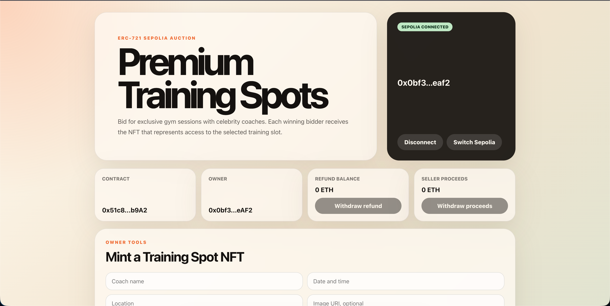
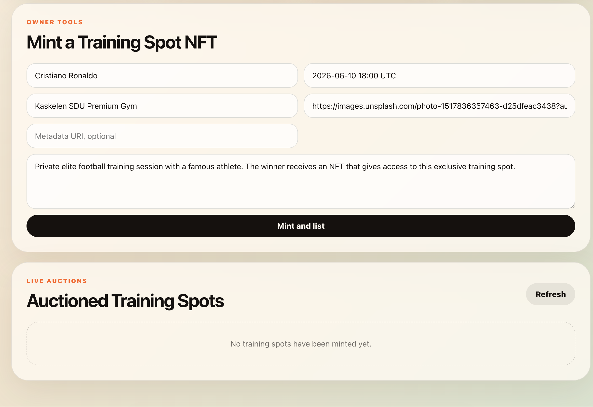
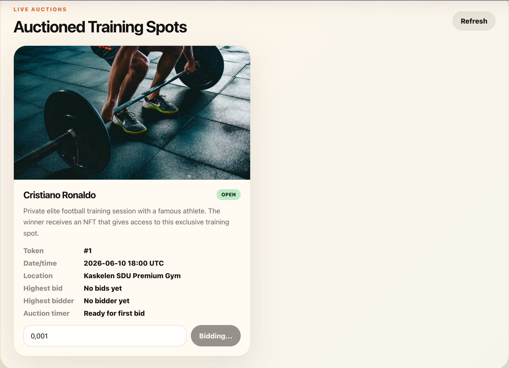

# Premium Training Spot Auction

ERC-721 auction dApp for exclusive training sessions with celebrity coaches. Each training spot is minted as a unique NFT and transferred to the highest bidder only after the auction is finalized.







## Features

- ERC-721 NFTs for premium training spots.
- Metadata stored on-chain in the auction listing: coach name, date/time, description, location and image URI.
- Optional ERC-721 `tokenURI` for metadata uploaded to IPFS or nft.storage.
- Only bids higher than the current highest bid are accepted.
- Previous highest bidders can withdraw their outbid ETH with `withdraw()`.
- Owner or seller can manually end an auction.
- Anyone can finalize an auction after 24 hours without a new bid.
- Sold NFTs cannot be bid on or sold again.
- React frontend with MetaMask, Sepolia check, bidding, finalization, refund withdrawal and seller proceeds withdrawal.

## Setup

Install dependencies:

```bash
npm install
```

Create an environment file:

```bash
cp .env.example .env
```

Fill `.env`:

```bash
SEPOLIA_RPC_URL=https://sepolia.infura.io/v3/YOUR_PROJECT_ID
PRIVATE_KEY=your_wallet_private_key_without_0x
VITE_CONTRACT_ADDRESS=your_deployed_contract_address
```

How to get `VITE_CONTRACT_ADDRESS`:

1. Leave `VITE_CONTRACT_ADDRESS` empty before deployment.
2. Fill `SEPOLIA_RPC_URL` and `PRIVATE_KEY`.
3. Run the deployment command:

```bash
npm run deploy:sepolia
```

4. The terminal will print a contract address like this:

```bash
TrainingSpotAuction deployed to: 0x1234567890abcdef...
```

5. Copy this address and paste it into `.env`:

```bash
VITE_CONTRACT_ADDRESS=0x1234567890abcdef...
```

6. Restart the frontend after changing `.env`:

```bash
npm run dev
```

## Smart Contract

Compile:

```bash
npm run compile
```

Run tests:

```bash
npm test
```

Deploy to Sepolia:

```bash
npm run deploy:sepolia
```

After deployment, copy the printed contract address into `.env` as `VITE_CONTRACT_ADDRESS`.

## Frontend

Start the local frontend:

```bash
npm run dev
```

Build production assets:

```bash
npm run build
```

Open the displayed Vite URL, connect MetaMask and switch to Sepolia.

## Auction Flow

1. Contract owner mints a training spot NFT from the frontend owner panel or by calling `mintTrainingSpot`.
2. The NFT is minted to the contract itself and listed for auction.
3. Users place bids in ETH through MetaMask.
4. If a higher bid arrives, the previous highest bid becomes withdrawable.
5. Owner or seller can call `endAuction` to finish manually.
6. If 24 hours pass after the latest bid, anyone can call `finalizeExpiredAuction`.
7. Finalization transfers the NFT to the highest bidder and records seller proceeds.

## Important Note

Blockchains do not execute code automatically at a future time. The 24-hour rule is enforced by `finalizeExpiredAuction`: after the timeout, a transaction must still be sent by any user or automation service to finalize the auction.
