# Project 2 Report: Auction of Premium Training Spots

## Student Information

Name: Daniyal Bazarbek

Project: Project 2 - Auction of Premium Training Spots

Network: Sepolia Test Network

Smart Contract: `TrainingSpotAuction.sol`

Frontend: React + Vite + ethers.js

## 1. Introduction

The goal of this project was to create a decentralized auction application for premium gym training spots with famous coaches and sportspeople. Each premium training spot is represented as a unique ERC-721 NFT. Users can bid for available training spots, and the highest bidder receives the NFT after the auction is finalized.

The NFT acts as proof of ownership for the exclusive right to attend the selected training session. The project includes a Solidity smart contract, a React frontend, MetaMask wallet integration, and Sepolia testnet deployment.

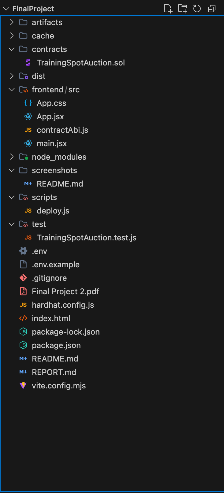

## 2. Technologies Used

The project was developed using the following technologies:

| Technology | Purpose |
| --- | --- |
| Solidity | Smart contract programming language |
| OpenZeppelin | Secure ERC-721, Ownable, and ReentrancyGuard contracts |
| Hardhat | Compilation, testing, and deployment |
| React | Frontend user interface |
| Vite | Frontend development and build tool |
| ethers.js | Interaction between frontend and smart contract |
| MetaMask | Wallet connection and transaction signing |
| Sepolia | Ethereum test network for deployment and testing |

## 3. Project Structure

The project contains both blockchain and frontend parts.

```text
contracts/
  TrainingSpotAuction.sol

scripts/
  deploy.js

test/
  TrainingSpotAuction.test.js

frontend/src/
  App.jsx
  App.css
  contractAbi.js
  main.jsx

hardhat.config.js
package.json
README.md
REPORT.md
.env.example
```

The `contracts` folder contains the Solidity smart contract. The `test` folder contains Hardhat tests. The `scripts` folder contains the deployment script. The `frontend` folder contains the React application.

## 4. Smart Contract Implementation

The main smart contract is called `TrainingSpotAuction`. It implements an ERC-721 NFT auction system for premium training spots.

The contract inherits from the following OpenZeppelin contracts:

| Contract | Reason |
| --- | --- |
| `ERC721URIStorage` | Creates ERC-721 NFTs and stores token metadata URI |
| `Ownable` | Restricts minting to the contract owner |
| `ReentrancyGuard` | Protects ETH withdrawal and bidding functions |
| `ERC721Holder` | Allows the contract to safely hold ERC-721 NFTs |

Each training spot stores the following information:

| Field | Description |
| --- | --- |
| `coachName` | Name of the famous coach or sportsperson |
| `trainingDateTime` | Date and time of the training session |
| `description` | Description of the session |
| `location` | Training location |
| `imageURI` | Optional image link, for example IPFS or nft.storage |
| `seller` | Address of the seller |
| `sold` | Shows whether the NFT was already sold |
| `exists` | Confirms that the training spot exists |

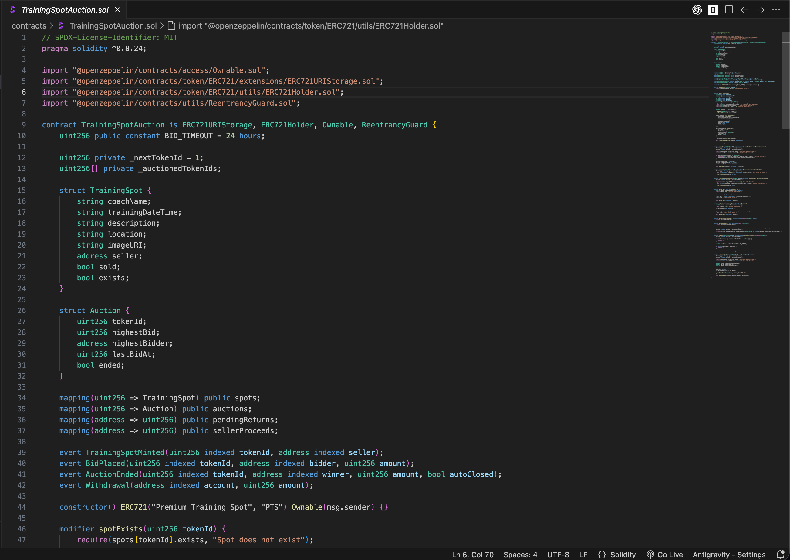

## 5. NFT Minting

Only the contract owner can mint new training spot NFTs. This is done using the `mintTrainingSpot` function.

When a new training spot is minted, the NFT is minted to the smart contract itself instead of directly to a user. This is important because the contract must control the NFT during the auction and transfer it only after the auction is finished.

The minting function saves the training spot metadata and creates a new auction for the token.

## 6. Auction Logic

Each NFT has an auction connected to it. The auction stores:

| Field | Description |
| --- | --- |
| `tokenId` | NFT ID |
| `highestBid` | Current highest bid amount |
| `highestBidder` | Address of the current highest bidder |
| `lastBidAt` | Timestamp of the latest bid |
| `ended` | Shows whether the auction has ended |

Users place bids using the `placeBid` function. The contract requires every new bid to be higher than the current highest bid. If the bid is not higher, the transaction is rejected.

When a new highest bid is placed, the previous highest bidder does not receive ETH immediately. Instead, the previous bid amount is stored in `pendingReturns`. The previous bidder can later withdraw their ETH using the `withdraw` function.

This withdrawal pattern is safer than sending ETH directly inside the bidding function.

## 7. Auction Finalization

The auction can be finalized in two ways.

Manual finalization is done by the owner or seller using the `endAuction` function.

Timeout finalization is done using the `finalizeExpiredAuction` function. If no new bid is made within 24 hours, anyone can call this function and finalize the auction. The last highest bidder becomes the winner.

After finalization:

| Result | Description |
| --- | --- |
| NFT transfer | The NFT is transferred to the highest bidder |
| Seller proceeds | The seller can withdraw the winning bid amount |
| Sold status | The NFT is marked as sold |
| No duplicate sale | The NFT cannot be auctioned or bought again |

Important: smart contracts cannot automatically run code after 24 hours by themselves. Therefore, the 24-hour rule is enforced by allowing a user or automation service to call `finalizeExpiredAuction` after the timeout.

## 8. Security and Edge Cases

The smart contract handles the required edge cases:

| Edge case | Solution |
| --- | --- |
| Bid must be higher | `placeBid` checks `msg.value > highestBid` |
| Sold NFT cannot be sold again | Contract checks `sold` and `ended` status |
| NFT transfer only after auction ends | NFT is held by the contract until finalization |
| Duplicate finalization prevented | Contract checks that auction has not ended |
| Previous bidder refund | Previous bid is saved in `pendingReturns` |
| Seller payment | Seller withdraws proceeds separately |
| Reentrancy protection | `nonReentrant` is used on ETH functions |
| Owner-only minting | `onlyOwner` modifier is used |

## 9. Frontend Implementation

The frontend was created using React and Vite. It allows users to interact with the smart contract through MetaMask.

The frontend includes:

| Feature | Description |
| --- | --- |
| MetaMask connection | Users can connect and disconnect their wallet |
| Sepolia check | The app checks that the user is on Sepolia |
| Auction list | Shows all minted training spot NFTs |
| Training spot details | Shows image, coach, date/time, location, highest bid, and highest bidder |
| Bid form | Users can enter an ETH amount and place a bid |
| Refund withdrawal | Previous bidders can withdraw their refunded ETH |
| Seller proceeds withdrawal | Seller can withdraw the final winning bid |
| Owner mint form | Only the deployer/owner can mint new training spots |
| Finalization buttons | Owner/seller can manually end, and expired auctions can be finalized |


## 10. Deployment Process

First, dependencies were installed using npm.

```bash
npm install
```

Then the smart contract was compiled.

```bash
npm run compile
```

The contract was deployed to the Sepolia test network.

```bash
npm run deploy:sepolia
```

After deployment, Hardhat printed the deployed contract address in the terminal. This address was copied into the `.env` file as `VITE_CONTRACT_ADDRESS`.

```env
VITE_CONTRACT_ADDRESS=0x51c82762c1aEB54C099F4ABF22baF1F1B21eb9A2
```

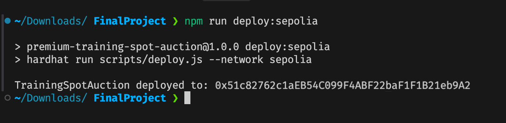

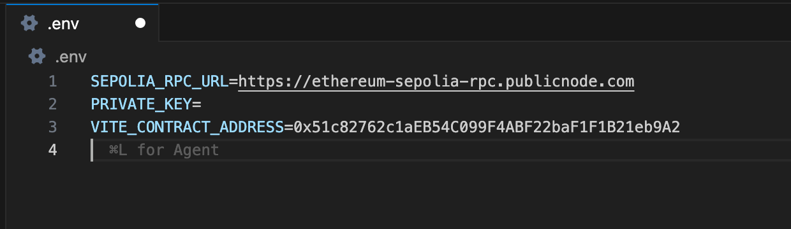

## 11. Running the Frontend

The frontend was started locally using Vite.

```bash
npm run dev
```

The application was opened in the browser using the localhost URL printed by Vite, usually `http://localhost:5173`.

MetaMask was connected to the website, and the Sepolia network was selected.

## 12. Testing

Automated tests were written with Hardhat in `test/TrainingSpotAuction.test.js`.

The tests check the following behavior:

| Test case | Purpose |
| --- | --- |
| Mint and list NFT | Confirms that a training spot NFT is created and listed |
| Higher bid rule | Confirms that lower or equal bids are rejected |
| Previous bidder refund | Confirms that outbid users can withdraw their ETH |
| Manual auction ending | Confirms owner can end auction and transfer NFT |
| 24-hour auto-close | Confirms auction can be finalized after timeout |
| Early auto-close rejection | Confirms timeout cannot be used before 24 hours |
| Duplicate sale prevention | Confirms sold NFTs cannot receive bids again |
| Owner-only minting | Confirms non-owner accounts cannot mint |

The test command was:

```bash
npm test
```

All tests passed successfully.

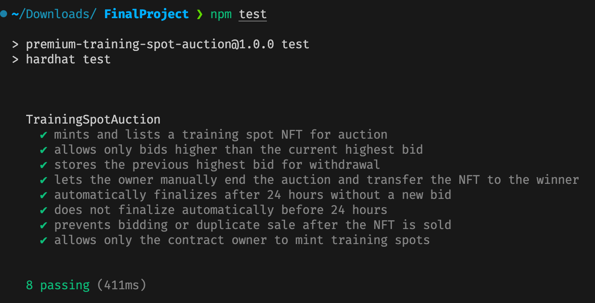

## 13. Manual Testing With MetaMask

Manual testing was done through the local frontend and MetaMask on Sepolia.

The manual test steps were:

1. Connected the deployer wallet with MetaMask.
2. Checked that the app detected the Sepolia network.
3. Minted a new training spot NFT using the owner form.
4. Confirmed the mint transaction in MetaMask.
5. Checked that the NFT appeared in the auction list.
6. Switched to another MetaMask account.
7. Placed a bid for the NFT.
8. Confirmed the bid transaction in MetaMask.
9. Checked that highest bid and highest bidder were updated.
10. Placed a higher bid from another account.
11. Checked that the previous bidder received a refund balance.
12. Withdrew the refund from the previous bidder account.
13. Switched back to the owner account.
14. Manually ended the auction.
15. Checked that the auction status changed to sold.
16. Withdrew seller proceeds.

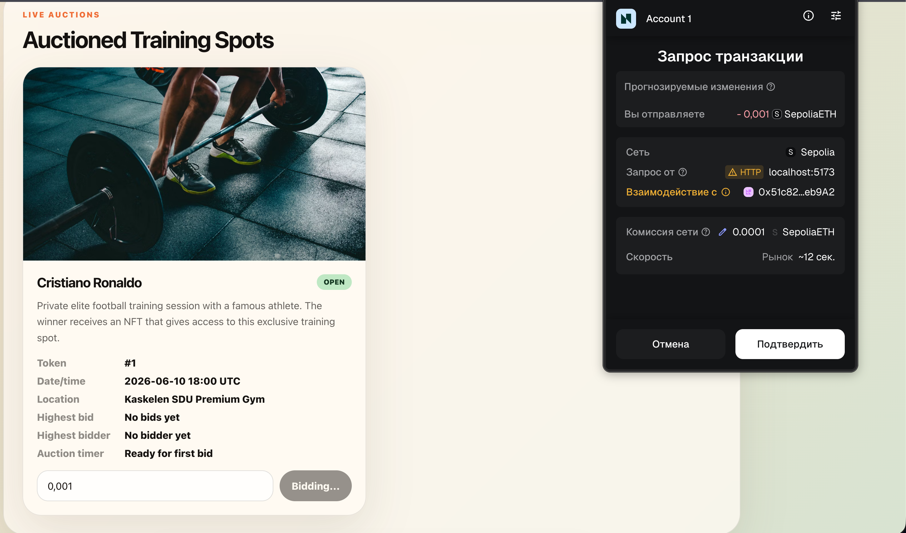

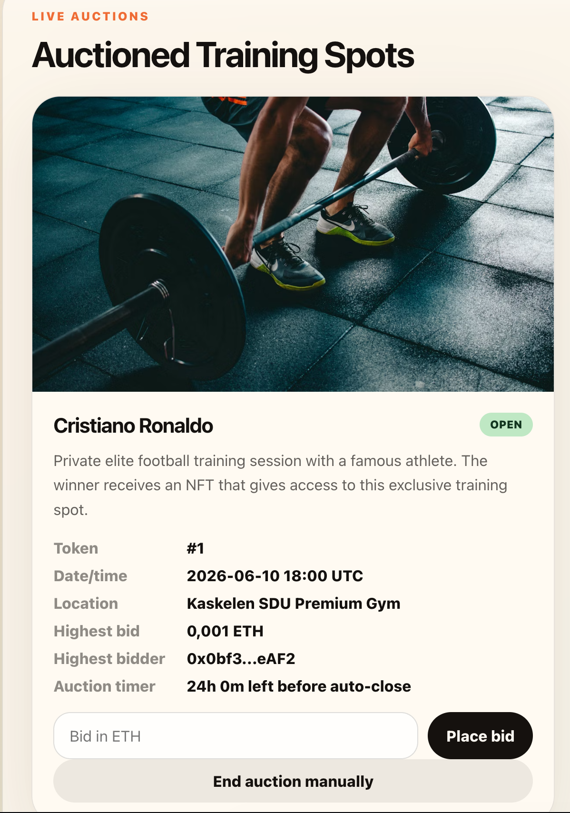

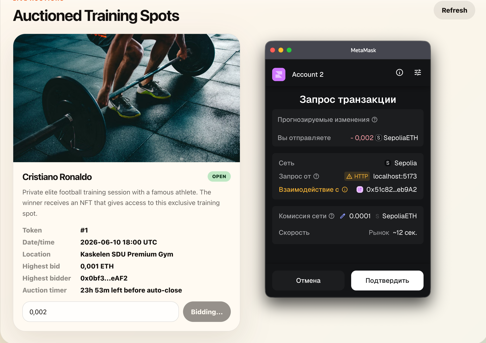

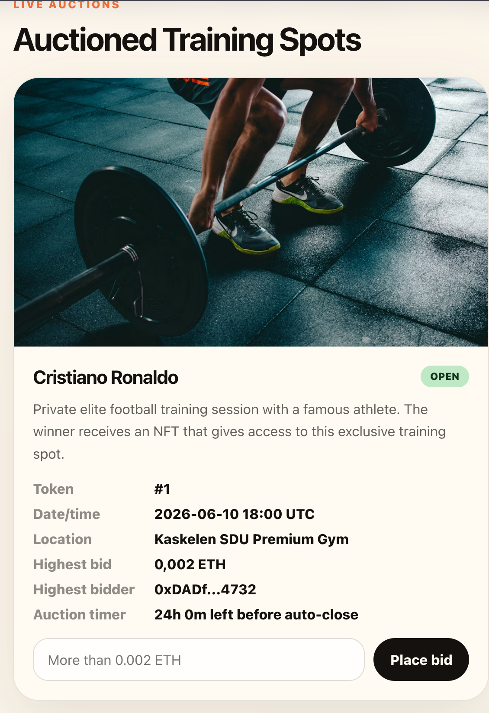

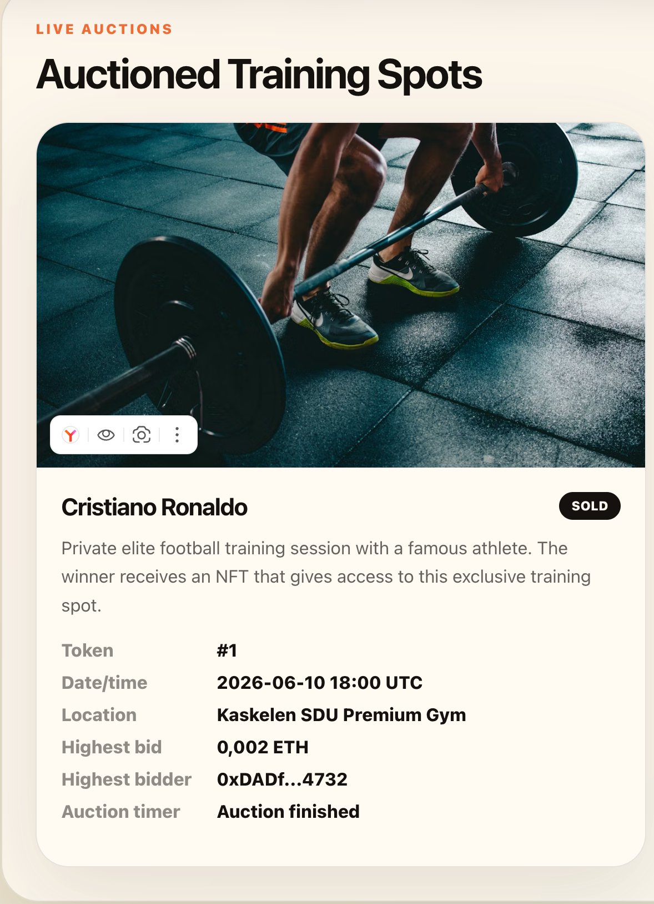

## 14. Etherscan Verification

The deployed smart contract and transactions can be checked on Sepolia Etherscan.

The Etherscan URL format is:

```text
https://sepolia.etherscan.io/address/0x51c82762c1aEB54C099F4ABF22baF1F1B21eb9A2
```

On Etherscan, it is possible to see the deployment transaction and user interactions such as minting, bidding, ending the auction, and withdrawals.

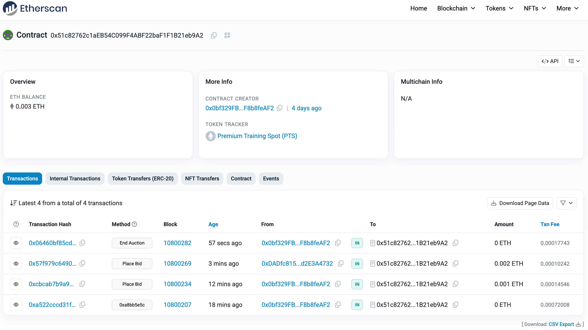

## 15. Conclusion

This project successfully implements an ERC-721 based auction system for premium training spots. The smart contract securely handles NFT minting, bidding, auction finalization, refunds, seller withdrawals, and duplicate sale prevention.

The React frontend allows users to connect MetaMask, view auctioned training spots, place bids, withdraw refunds, and finalize auctions. The contract was tested with Hardhat and deployed to the Sepolia test network.

The final result satisfies the main requirements of the project: ERC-721 NFTs, auction functionality, MetaMask integration, Sepolia deployment, edge case handling, and smart contract security checks.
